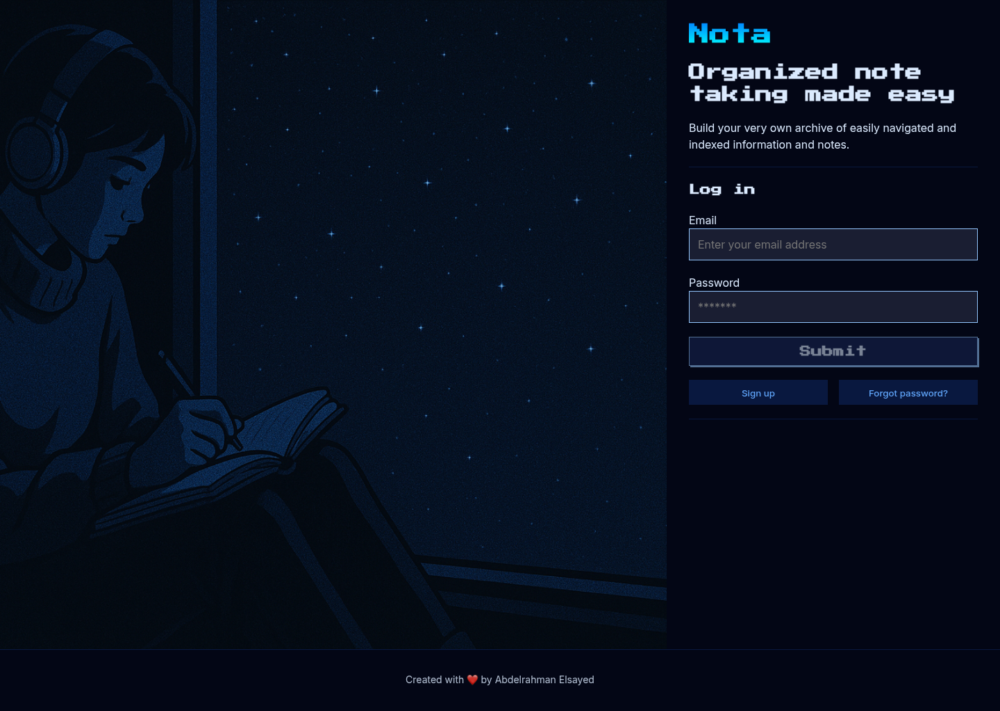

# Nota

A simple note-taking app where you can write, edit, and organize your notes in Markdown. Sign up, start writing, and all your notes sync to the cloud instantly.

**Try it live:** [notaaaaa.vercel.app](https://notaaaaa.vercel.app/)



## Overview

Built with Next.js, React, and Firebase. Create an account, write your notes in Markdown, and watch them save automatically. Switch between editor and preview mode to see your content formatted in real-time.

## What You Get

- **Sign Up & Login** - Quick email and password authentication
- **Write Notes** - Create and edit notes in a clean, simple editor
- **Markdown Preview** - See how your notes look formatted in real-time
- **Organize Notes** - View all your notes in the sidebar
- **Delete Notes** - Remove notes you no longer need
- **Real-time Sync** - All your notes save to Firebase instantly
- **Responsive Design** - Works on phone, tablet, and desktop

## Tech Stack

**Frontend:**

- Next.js 16.1.6 - Framework
- React 19.2.3 - UI library

**Backend & Database:**

- Firebase 12.11.0 - Authentication and database

## Project Structure

```
nota/
├── app/                    # Next.js app directory
│   ├── layout.js          # Root layout with navigation
│   ├── page.js            # Home/login page
│   ├── globals.css        # Global styles
│   ├── head.js            # HTML head metadata
│   ├── page.module.css    # Home page styles
│   └── notes/
│       ├── layout.js      # Notes layout
│       └── page.js        # Notes page (main app)
├── components/            # Reusable components
│   ├── Editor.jsx         # Text editor for writing notes
│   ├── MDX.jsx            # Markdown preview viewer
│   ├── SideNav.jsx        # Sidebar with note list
│   ├── TopNav.jsx         # Top navigation bar
│   ├── Login.jsx          # Login and signup form
│   └── Footer.jsx         # Footer component
├── context/               # State management
│   └── AuthContext.jsx    # User auth and session
├── public/                # Static files
├── firebase.js            # Firebase setup
├── package.json           # Dependencies
├── next.config.mjs        # Next.js config
└── jsconfig.json          # JavaScript config
```

## Getting Started

### Requirements

- Node.js 18 or higher
- npm or yarn
- Firebase project credentials

### Setup Steps

1. **Clone the repository**

   ```bash
   git clone https://github.com/yourusername/nota.git
   cd nota
   ```

2. **Install dependencies**

   ```bash
   npm install
   ```

3. **Add Firebase credentials**

   Create a `.env.local` file in the root directory:

   ```env
   NEXT_PUBLIC_FIREBASE_APIKEY=your_api_key
   NEXT_PUBLIC_FIREBASE_AUTHDOMAIN=your_auth_domain
   NEXT_PUBLIC_FIREBASE_PROJECTID=your_project_id
   NEXT_PUBLIC_FIREBASE_STORAGEBUCKET=your_storage_bucket
   NEXT_PUBLIC_FIREBASE_MESSAGINGSENDERID=your_messaging_sender_id
   NEXT_PUBLIC_FIREBASE_APPID=your_app_id
   NEXT_PUBLIC_FIREBASE_MEASUREMENTID=your_measurement_id
   ```

4. **Start the development server**

   ```bash
   npm run dev
   ```

   Open [http://localhost:3000](http://localhost:3000) in your browser.

## Available Commands

- `npm run dev` - Start development server
- `npm run build` - Create production build
- `npm start` - Run production build
- `npm run lint` - Check code with ESLint

## How It Works

### User Journey

1. **Land on the home page** - See the app and login or sign up
2. **Create your account** - Just email and password
3. **Go to your notes** - Start writing
4. **Switch modes** - Toggle between editor and preview
5. **Your notes save** - No need to click save, it happens automatically
6. **View all notes** - See your note list in the sidebar
7. **Delete notes** - Remove ones you don't need

### Where Data is Stored

Your notes are stored in Firebase Firestore with this structure:

```
users/{uid}
  └── notes/{noteId}
       ├── content: "your markdown text"
       ├── createdAt: timestamp
       └── updatedAt: timestamp
```

### Main Features

- **Editor** - Simple textarea for writing your notes
- **Markdown Viewer** - See formatted output with headers, links, and text styling
- **Note Management** - Create, edit, and delete notes
- **Authentication** - Secure login with Firebase Auth
- **Auto-save** - Notes save automatically to Firestore

## Environment Variables

You need these Firebase credentials in `.env.local`:

| Variable                                 | Description                  |
| ---------------------------------------- | ---------------------------- |
| `NEXT_PUBLIC_FIREBASE_APIKEY`            | Firebase API key             |
| `NEXT_PUBLIC_FIREBASE_AUTHDOMAIN`        | Firebase auth domain         |
| `NEXT_PUBLIC_FIREBASE_PROJECTID`         | Firebase project ID          |
| `NEXT_PUBLIC_FIREBASE_STORAGEBUCKET`     | Firebase storage bucket      |
| `NEXT_PUBLIC_FIREBASE_MESSAGINGSENDERID` | Firebase messaging sender ID |
| `NEXT_PUBLIC_FIREBASE_APPID`             | Firebase app ID              |
| `NEXT_PUBLIC_FIREBASE_MEASUREMENTID`     | Firebase measurement ID      |

## Future Improvements

- [ ] Rich text editor with formatting tools
- [ ] Note folders and categories
- [ ] Search functionality
- [ ] Dark mode
- [ ] Export notes as PDF or text
- [ ] Share notes with others
- [ ] Collaborative editing
- [ ] Note tags and labels
- [ ] Version history

## Performance

- Fast page loads with Next.js
- Real-time sync with Firebase
- Optimized for mobile and desktop
- Automatic saving - no manual sync needed

## Contributing

Found a bug? Have a feature idea? Fork the repo and submit a pull request.

## License

[MIT](./LICENSE) - Use this project freely.
